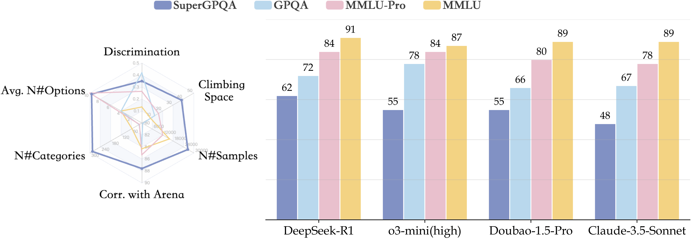

<h2 align="center" style="font-size: 2.5em; font-weight: bold; color: #2c3e50;">
  <i>SuperGPQA</i>: Scaling LLM Evaluation across<br>
  285 Graduate Disciplines
</h2>

<p align="center">
  <a href="https://supergpqa.github.io/" style="margin: 0 10px;">🌐 Homepage</a> |
  <a href="https://huggingface.co/datasets/m-a-p/SuperGPQA" style="margin: 0 10px;">🤗 Dataset</a> |
  <a href="https://arxiv.org/abs/2502.14739" style="margin: 0 10px;">📖 ArXiv</a> |
  <a href="https://huggingface.co/spaces/m-a-p/SuperGPQA" style="margin: 0 10px;">🏆 Leaderboard</a> |
  <a href="https://github.com/SuperGPQA/SuperGPQA" style="margin: 0 10px;">🐙 GitHub</a>
</p>


This repository contains the evaluation code for the paper "[SuperGPQA: Scaling LLM Evaluation across 285 Graduate Disciplines]()".

---

## 🔔 Introduction


<p align="center">
   
</p>


**SuperGPQA** is a comprehensive benchmark that evaluates graduate-level knowledge and reasoning capabilities across 285 disciplines. Our benchmark employs a novel Human-LLM collaborative filtering mechanism to eliminate trivial or ambiguous questions through iterative refinement based on both LLM responses and expert feedback. Our experimental results reveal significant room for improvement in the performance of current state-of-the-art LLMs across diverse knowledge domains (e.g., the reasoning-focused model DeepSeek-R1 achieved the highest accuracy of 61.82% on **SuperGPQA**), highlighting the considerable gap between current model capabilities and artificial general intelligence. Additionally, we present comprehensive insights from our management of a large-scale annotation process, involving over 80 expert annotators and an interactive Human-LLM collaborative system, offering valuable methodological guidance for future research initiatives of comparable scope.

## 🏆 Main Result
The table below presents the performance of various models across different tasks and difficulty levels. The models are categorized into three main groups: Reasoning Models, Chat Models, and Base Models. Each model is evaluated based on overall performance (sample, subfield, field, and discipline), as well as performance on easy, medium, and hard samples. The performance scores are provided to give an overview of how each model performs across different aspects, allowing for a comparison of strengths and weaknesses.

All results can be viewed on the [leaderboard](https://huggingface.co/spaces/m-a-p/SuperGPQA) and all model's response/answer can be viewed on [here](https://huggingface.co/datasets/m-a-p/SuperGPQA-Records)

**Reasoning Models**
| Model                          | Overall (sample) | Overall (subfield) | Overall (field) | Overall (discipline) | Easy (sample) | Middle (sample) | Hard (sample) |
|--------------------------------|------------------|--------------------|-----------------|----------------------|---------------|-----------------|---------------|
| DeepSeek-R1                    | 61.82            | 62.61              | 61.23           | 59.95                | 63.59         | 63.63           | 56.87         |
| o1-2024-12-17                  | 60.24            | 61.25              | 59.94           | 59.44                | 64.40         | 61.44           | 53.67         |
| DeepSeek-R1-Zero               | 60.24            | 61.62              | 60.95           | 60.99                | 65.06         | 62.61           | 50.99         |
| o3-mini-2025-01-31-high        | 55.22            | 54.94              | 52.11           | 48.32                | 53.05         | 56.09           | 56.16         |
| o3-mini-2025-01-31-medium      | 52.69            | 52.66              | 49.95           | 46.07                | 51.30         | 53.79           | 52.37         |

**Chat Models**
| Model                          | Overall (sample) | Overall (subfield) | Overall (field) | Overall (discipline) | Easy (sample) | Middle (sample) | Hard (sample) |
|--------------------------------|------------------|--------------------|-----------------|----------------------|---------------|-----------------|---------------|
| Doubao-1.5-pro-32k-250115      | 55.09            | 56.55              | 55.62           | 54.39                | 57.70         | 60.15           | 43.80         |
| Doubao-1.5-pro-32k-241225      | 50.93            | 52.41              | 51.76           | 51.24                | 53.54         | 56.56           | 38.70         |
| Qwen-max-2025-01-25            | 50.08            | 52.75              | 52.47           | 51.65                | 58.16         | 54.95           | 33.09         |
| Claude-3-5-sonnet-20241022     | 48.16            | 51.38              | 51.23           | 53.15                | 59.04         | 51.91           | 29.99         |
| Gemini-2.0-flash               | 47.73            | 48.70              | 47.80           | 46.10                | 53.06         | 49.56           | 38.84         |

**Base Models**
| Model                          | Overall (sample) | Overall (subfield) | Overall (field) | Overall (discipline) | Easy (sample) | Middle (sample) | Hard (sample) |
|--------------------------------|------------------|--------------------|-----------------|----------------------|---------------|-----------------|---------------|
| Qwen2.5-72B                    | 34.33            | 38.08              | 38.70           | 39.54                | 46.20         | 38.12           | 15.01         |
| Qwen2.5-32B                    | 33.16            | 36.52              | 37.33           | 38.29                | 45.12         | 36.58           | 14.34         |
| DeepSeek-V3-Base               | 32.14            | 34.79              | 34.58           | 34.71                | 41.28         | 34.50           | 18.20         |
| Qwen2.5-14B                    | 30.19            | 33.33              | 34.14           | 34.54                | 42.27         | 31.44           | 14.85         |
| Yi-1.5-34B                     | 27.62            | 30.78              | 31.03           | 32.55                | 39.68         | 27.95           | 13.86         |

## 🔢 Dataset Statistics 

<!-- (For more information, visit [main_result](data/main.xlsx)) -->

| Discipline   | Agr. | Eco. | Edu. | Eng. | His. | Law | Lit. & Arts | Man. | Med. | Mil. Sci. | Phil. | Sci. | Soc. |
|--------------|------|------|------|------|------|-----|-------------|------|------|-----------|-------|------|------|
| Total        | 485  | 873  | 484  | 7892 | 674  | 656 | 1676        | 501  | 2755 | 205       | 347   | 9838 | 143  |

#### Abbreviations:
Agr. = Agronomy, Eco. = Economics, Edu. = Education, Eng. = Engineering, His. = History, 
Law = Law, Lit. & Arts = Literature and Arts, Man. = Management, Med. = Medicine, 
Mil. Sci. = Military Science, Phil. = Philosophy, Sci. = Science, Soc. = Sociology


---

## ⚙️ Installation 

To install the required packages, run:

```bash
# Prepare repository and environment
git clone git@github.com:SuperGPQA/SuperGPQA.git
cd ./SuperGPQA
pip install -r requirements.txt
```

---

## 🧠 Inference

You can directly perform inference on the selected models using the following command:
```bash
export PYTHONPATH=$(pwd)

# Local model inference
python infer/infer.py --config <CONFIG_PATH> --split <TASKS> --mode <MODE> --model_name <MODEL_NAME> --output_dir <OUTPUT_DIR> --batch_size <BATCH_SIZE> --use_accel --index <INDEX> --world_size <WORLD_SIZE>

# API model inference
python infer/infer.py --config <CONFIG_PATH> --split <TASKS> --mode <MODE> --model_name <MODEL_NAME> --output_dir <OUTPUT_DIR> --num_worker <NUM_WORKERS> --index <INDEX> --world_size <WORLD_SIZE>
```

Example:
```bash
export PYTHONPATH=$(pwd)

# Local model inference with zero-shot mode
python infer/infer.py --config config/config_default.yaml --split SuperGPQA-all --mode zero-shot --model_name Doubao-1.5-pro-32k-250115 --output_dir results --num_worker 128 --index 0 --world_size 1

# Local reasoning model inference with zero-shot mode
python infer/infer.py --config config/config_reasoning_models.yaml --split SuperGPQA-all --mode zero-shot --model_name DeepSeek-R1 --output_dir results --num_worker 128 --index 0 --world_size 1

# Local chat model inference with accelerated setup and zero-shot mode
python infer/infer.py --config config/config_default.yaml --split SuperGPQA-all --mode zero-shot --model_name Qwen2.5-0.5B-Instruct --output_dir results --batch_size 1000 --use_accel --index 0 --world_size 1

# Local chat model inference with five-shot mode
python infer/infer.py --config config/config_default.yaml --split SuperGPQA-all --mode five-shot --model_name Qwen2.5-0.5B --output_dir results --batch_size 1000 --use_accel --index 0 --world_size 1
```

More examples can be found in the shell scripts of this repository. 🔗

**Parameter Explanations for Inference Script**
- config: Path to the configuration file.
- split: Specify the task categories for evaluation.
Available options include:
        - SuperGPQA-all (or any other task list depending on the model being used).
-  mode: Choose from different evaluation modes (zero-shot, five-shot). Default is to evaluate all modes.
- use_accel: Enables acceleration options for faster inference. All local model experimental results in this repository use vllm for acceleration.
- num_worker: Set the number of concurrent workers (for API calls). For local models, this should typically be set to 1.
- batch_size: Set the batch size for local model inference. This is especially useful for models that can process multiple examples at once (e.g., local chat models).
- index: The index for the data split. It determines which part of the dataset is processed.
- world_size: Defines the size of the distributed setup (useful for multi-node inference).

📝 Notes
- If the inference is unexpectedly interrupted, a temporary file .jsonl.tmp will be saved. You can directly rerun the command to resume from the last checkpoint.
- After inference is complete, check the response field in the saved JSONL file in the output_dir. This field should typically be of string type; if it is of dict type, the error field will contain error information. You can rerun the command to re-infer any issues that caused errors.

🛠️ Run Custom Model
- --model_name: This parameter must align with the filenames in the infer/models directory. You can choose from available built-in models.
- Adding a Custom Model:
        1. Create a new .py file for your model in the infer/models directory.
        2. Update the configuration in __init__.py to include the new model.
- For more details, please refer to the documentation for the specific model you want to add.

---

## ⭐ Evaluation
After completing the inference and ensuring no error messages are displayed, proceed with the answer parsing and evaluation pipeline as follows:

```bash
export PYTHONPATH=$(pwd)

# Evaluate results
python eval/eval.py --evaluate_all --excel_output --json_output --output_dir results --save_dir results_with_status
```

## 📜 License

**SuperGPQA** is a composite dataset that includes both original content and portions of data derived from other sources. The dataset is made available under the **[Open Data Commons Attribution License (ODC-BY)](https://opendatacommons.org/licenses/by/)**, which asserts no copyright over the underlying content. 

This means that while the dataset itself is freely available for use, you are required to:  
- Give appropriate credit to the original creators of any third-party data included in SuperGPQA.  
- Comply with the respective licenses of the referenced datasets.  

For more details, please refer to the [ODC-BY License](https://opendatacommons.org/licenses/by/) and the licenses of the referenced datasets.

### 🔗 Referenced Datasets & Links

SuperGPQA includes a limited portion of data sourced from the following datasets:

- **[LawBench](https://lawbench.opencompass.org.cn/home)**
- **[MedMCQA](https://medmcqa.github.io/)**
- **[MedQA](https://github.com/jind11/MedQA)**
- **[MMLU-Pro](https://huggingface.co/datasets/TIGER-Lab/MMLU-Pro)**
- **[MMLU-CF](https://huggingface.co/datasets/microsoft/MMLU-CF)**
- **[ShoppingMMLU](https://github.com/KL4805/ShoppingMMLU)**
- **[UTMath](https://utmathhomepage.github.io/)**
- **[MusicTheoryBench](https://ezmonyi.github.io/ChatMusician/)**
- **[Omni-Math](https://omni-math.github.io/)**
- **[U-MATH](https://toloka.ai/math-benchmark)**
- **[Putnam-AXIOM](https://huggingface.co/Putnam-AXIOM)**
- **[Short-form Factuality](https://github.com/openai/simple-evals)**
- **[Chinese SimpleQA](https://openstellarteam.github.io/ChineseSimpleQA/)**
- **[AIME-AOPS](https://artofproblemsolving.com/wiki/index.php/AIME_Problems_and_Solutions?srsltid=AfmBOooGfWIPceky_dYe-owTh_eTCSEqh2NCUi3FhVREjxJ5AeSjjhbo)**
- **[AIMO Validation AIME](https://huggingface.co/datasets/AI-MO/aimo-validation-aime)**

## ⚠️ Usage Notice

1. **SuperGPQA is primarily composed of newly created data**, but it also incorporates a small fraction of transformed content from other datasets.
2. If using SuperGPQA, please **comply with the original dataset licenses** when dealing with any referenced content.
3. We encourage proper attribution—if you use SuperGPQA in your research, please **cite and acknowledge the original dataset contributors**.

## 📚 Citation

**BibTeX:**
```bibtex
@misc{pteam2025supergpqascalingllmevaluation,
      title={SuperGPQA: Scaling LLM Evaluation across 285 Graduate Disciplines}, 
      author={M-A-P Team and Xinrun Du and Yifan Yao and Kaijing Ma and Bingli Wang and Tianyu Zheng and Kang Zhu and Minghao Liu and Yiming Liang and Xiaolong Jin and Zhenlin Wei and Chujie Zheng and Kaixing Deng and Shuyue Guo and Shian Jia and Sichao Jiang and Yiyan Liao and Rui Li and Qinrui Li and Sirun Li and Yizhi Li and Yunwen Li and Dehua Ma and Yuansheng Ni and Haoran Que and Qiyao Wang and Zhoufutu Wen and Siwei Wu and Tianshun Xing and Ming Xu and Zhenzhu Yang and Zekun Moore Wang and Junting Zhou and Yuelin Bai and Xingyuan Bu and Chenglin Cai and Liang Chen and Yifan Chen and Chengtuo Cheng and Tianhao Cheng and Keyi Ding and Siming Huang and Yun Huang and Yaoru Li and Yizhe Li and Zhaoqun Li and Tianhao Liang and Chengdong Lin and Hongquan Lin and Yinghao Ma and Zhongyuan Peng and Zifan Peng and Qige Qi and Shi Qiu and Xingwei Qu and Yizhou Tan and Zili Wang and Chenqing Wang and Hao Wang and Yiya Wang and Yubo Wang and Jiajun Xu and Kexin Yang and Ruibin Yuan and Yuanhao Yue and Tianyang Zhan and Chun Zhang and Jingyang Zhang and Xiyue Zhang and Xingjian Zhang and Yue Zhang and Yongchi Zhao and Xiangyu Zheng and Chenghua Zhong and Yang Gao and Zhoujun Li and Dayiheng Liu and Qian Liu and Tianyu Liu and Shiwen Ni and Junran Peng and Yujia Qin and Wenbo Su and Guoyin Wang and Shi Wang and Jian Yang and Min Yang and Meng Cao and Xiang Yue and Zhaoxiang Zhang and Wangchunshu Zhou and Jiaheng Liu and Qunshu Lin and Wenhao Huang and Ge Zhang},
      year={2025},
      eprint={2502.14739},
      archivePrefix={arXiv},
      primaryClass={cs.CL},
      url={https://arxiv.org/abs/2502.14739}, 
}

